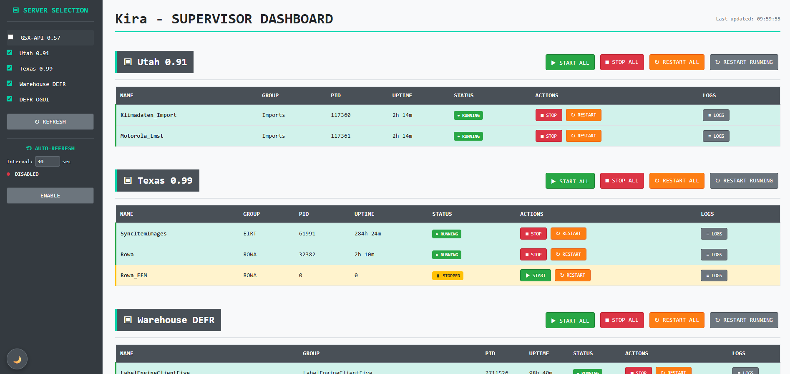

# Kira - Supervisor Dashboard

A user-friendly web dashboard for managing Supervisor processes across multiple servers.



## 🚀 Features

- **Multi-Server Support**: Manage multiple Supervisor instances from a single dashboard
- **Real-time Monitoring**: Live status and uptime information for all processes
- **Bulk Actions**: Start, stop, and restart all processes with a single click
- **Individual Process Control**: Granular control over individual processes
- **Log Viewer**: Integrated log viewer for STDOUT and STDERR
- **Auto-Refresh**: Automatic dashboard data updates
- **Dark Mode**: Toggle-able UI for better user experience
- **Responsive Design**: Optimized for desktop and mobile devices

## 📋 System Requirements

- PHP 7.4 or higher
- Composer
- Supervisor on target servers
- XML-RPC support in PHP

## 📦 Installation

1. **Clone the repository**:
   ```bash
   git clone <repository-url>
   cd kira
   ```

2. **Install dependencies**:
   ```bash
   composer install
   ```

3. **Environment configuration**:
   ```bash
   cp ".env example" .env
   ```

4. **Configure settings**:
   Edit the `.env` file with your server settings.

## ⚙️ Configuration

### Environment Variables (`.env`)

```env
# Hydra Environment Configuration
HYDRA_ENV=development
HYDRA_DEBUG=true
TIMEZONE=Europe/Berlin

# Performance Settings
CACHE_TIMEOUT=5
REQUEST_TIMEOUT=10
MAX_PROCESSES_PER_PAGE=1000

# Server 1 - Local Development (Example)
SUPERVISOR_1_URL=http://172.0.0.1:9001/RPC2
SUPERVISOR_1_USER=your_username
SUPERVISOR_1_PASS=your_password
SUPERVISOR_1_DISPLAY_NAME=Local Development
SUPERVISOR_1_TIMEOUT=5
SUPERVISOR_1_ENABLED=true

# Server 2 - Production Server (Example)
SUPERVISOR_2_URL=http://172.0.0.1:9001/RPC2
SUPERVISOR_2_USER=your_username
SUPERVISOR_2_PASS=your_password
SUPERVISOR_2_DISPLAY_NAME=Production Server
SUPERVISOR_2_TIMEOUT=10
SUPERVISOR_2_ENABLED=true

# Add more servers as needed...
```
